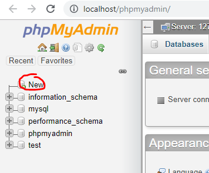
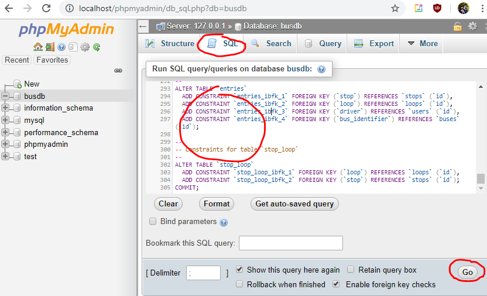
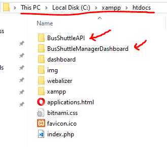
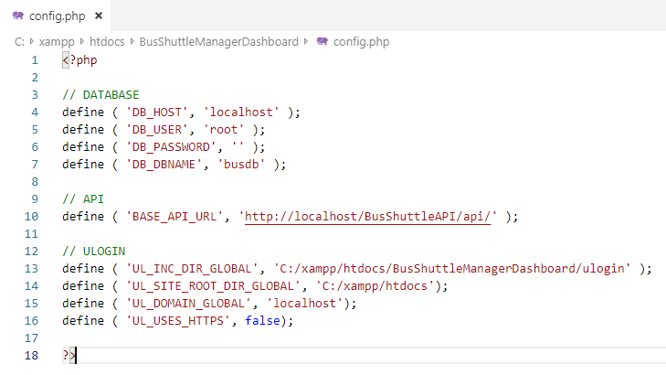
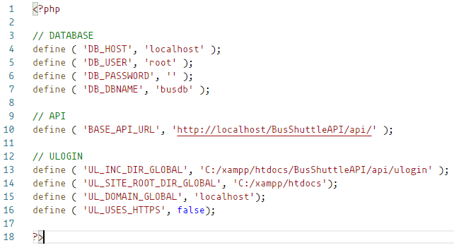
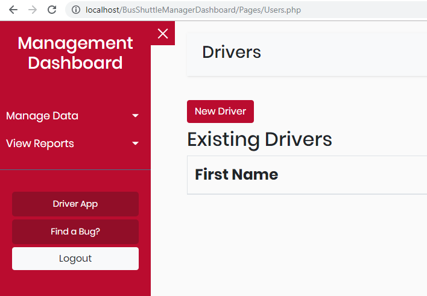
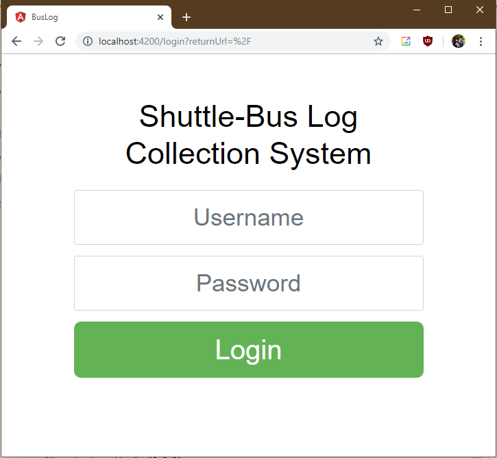

# Development Environment Manual

## BACKEND & FRONTEND (for manager dashboard & API)

### Install Prerequisites

*   Install XAMPP (v7.3.11 is tested)
    *   <a href="https://www.apachefriends.org/download.html" target="_blank">https://www.apachefriends.org/download.html</a>
    *   Run the apache and mysql by running **xampp-control.exe** (or corresponding executable if you are in MAC).
    *   

### Create DB Tables

*   Browse to <a href="http://localhost/phpMyAdmin/" target="_blank">http://localhost/phpMyAdmin/</a>
    *   Default username should be **root** without a password if asked.
*   Create a database by using the new button on top-left.
    *   
    *   Database name: **busdb**
    *   Leave everything else same and click **create**.
*   Click on the new **busdb** and select **SQL** tab.
*   Copy the contents of this sql file.
    *   <a href="https://github.com/hergin/BusShuttleMainRepository/blob/master/Resources/SchemaWithAuth.sql" target="_blank">https://github.com/hergin/BusShuttleMainRepository/blob/master/Resources/SchemaWithAuth.sql</a>
*   Paste it into the textbox in **SQL** tab and click **GO** button on bottom-right.
    *   
*   Do the same for **SampleUser.sql** file.
    *   Copy the content of the file:
        *  <a href="https://raw.githubusercontent.com/hergin/BusShuttleMainRepository/master/Resources/SampleUser.sql" target="_blank">https://raw.githubusercontent.com/hergin/BusShuttleMainRepository/master/Resources/SampleUser.sql</a>
    *   Paste it into **SQL** tab.
    *   Click **GO** button.

### Clone Repositories

*   Browse to **C:/xampp/htdocs** folder. (find the relevant folder under xampp installation in MAC)
*   Clone the two repositories in that folder.
    *  <a href="https://github.com/hergin/BusShuttleManagerDashboard.git" target="_blank">https://github.com/hergin/BusShuttleManagerDashboard.git</a>
    *  <a href="https://github.com/hergin/BusShuttleAPI.git" target="_blank">https://github.com/hergin/BusShuttleAPI.git</a>
*   You can do it via command line (or choose your own way of cloning a repository, NOT DOWNLOADING).  

    *   **Shift+Right-click** to an empty place on that folder to open a command line.
    *   Run these commands (it assumes you have **git** installed and **git** command accessible in PATH environment variable):
        *   <pre>git clone https://github.com/hergin/BusShuttleManagerDashboard.git</pre>
        *   <pre>git clone https://github.com/hergin/BusShuttleAPI.git</pre>

*   You must have the following folder structure if you did everything successfully.
    *   

### Updating Paths and Variables for Local

*   If you kept everything default (like the names of repositories while cloning, installation folder of xampp, DB user name and password), you wouldn't need to change the following config files.
*   Here is the content of the **config.php** in the **BusShuttleManagerDashboard** folder. You should update the necessary items that need to change.
    *   
*   Here is the content of the **config.php** file in **BusShuttleAPI/api** folder. You should update the necessary items that need to change.
    *   

### Test the Development Environment

*   Simply browse to <a href="http://localhost/BusShuttleManagerDashboard" target="_blank">http://localhost/BusShuttleManagerDashboard</a>
*   Enter user name 'local' and password 'local'.
*   You should see the following screen:
    *   
*   You can add a new driver in this screen.
    *   When you get the success message, refresh the page to see the new driver.

## FRONTEND (for driver app)

### Installing Prerequisites

*   Install NodeJS (v12.13.1 LTS is tested)
    *   <a href="https://nodejs.org/en/" target="_blank">https://nodejs.org/en/</a>
*   Install Angular CLI (this is installed through command line)
    *   <a href="https://angular.io/cli" target="_blank">https://angular.io/cli</a>

### Clone Repository

*   Clone this repository anywhere you want:
    *   <a href="https://github.com/hergin/BusShuttleDriverApp.git" target="_blank">https://github.com/hergin/BusShuttleDriverApp.git</a>
    *   Check above sections to do it from command line.
*   Open the folder after cloning in the command line.
    *   If you cloned using command line, just cd into directory by:
        *   <pre>cd BusShuttleDriverApp</pre>

### Install Dependencies

*   Install dependencies by running the command below.
    *   <pre>npm install</pre>

    *   This might take some time.

### Run the App

*   Run the app by running the command below.
    *   <pre>ng serve --open</pre>

    *   If you can't run **ng** command in the command line, you might want to try the full path.
        *   It is usually here: **C:\Users\{your_user_name}\AppData\Roaming\npm\ng**
        *   Run this command instead:
            *   <pre>C:\Users\{your_user_name}\AppData\Roaming\npm\ng serve --open</pre>

*   It will automatically open the following browser window. (If it doesn't, browse to <a href="http://localhost:4200" target="_blank">http://localhost:4200</a>
    *   
    *   Login using the same name and password as manager dashboard (local:local)